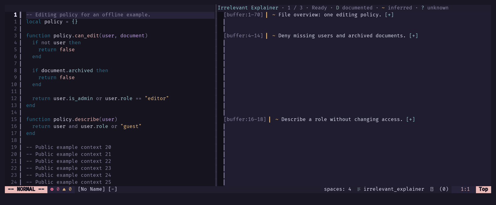
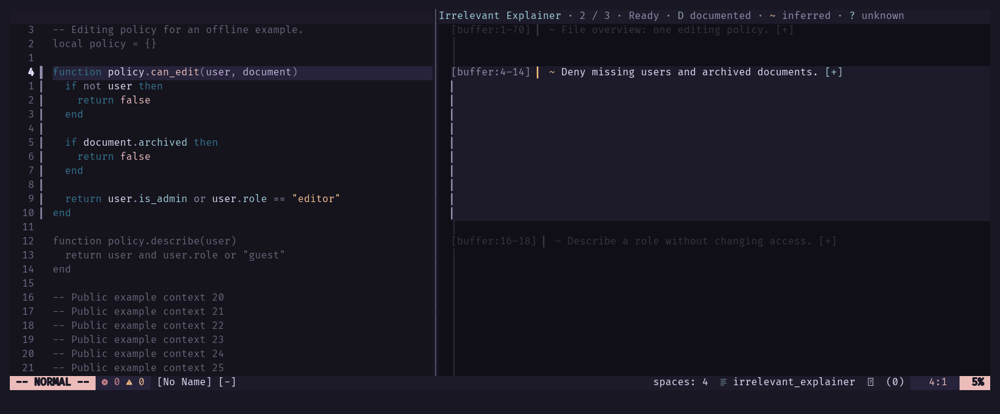
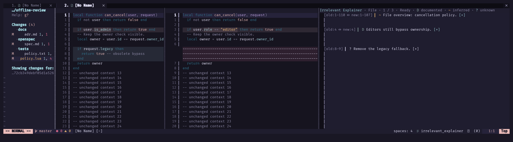
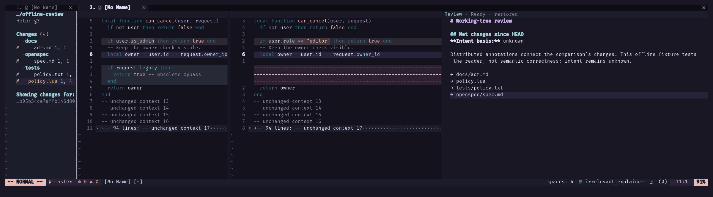

# Irrelevant Explainer

*Explanations for code nobody needs to understand anymore.*

The agents write the code. The agents explain the code. I built a Neovim plugin
so I can watch my own redundancy in a tasteful colorscheme.

**Built for my personal use. Published as a showcase and for inspiration.**
Borrow ideas, adapt it, or admire the effort spent automating the wrong existential crisis.
No promised support, stable API, maintenance schedule, or roadmap.

In less theatrical terms: AI-generated notes beside code and diffs, expandable
detail, and a whole-change narrative. The futility is the joke; the explanations aren't.

## Install the coping mechanism

Requires **Neovim 0.11+**. With [lazy.nvim](https://github.com/folke/lazy.nvim):

```lua
{
  "javoscript/irrelevant-explainer.nvim",
  main = "irrelevant_explainer",
  opts = {},
}
```

- Other managers: install the repo, then call `require("irrelevant_explainer").setup()`.
- Diffs/reviews: also install [Diffview](https://github.com/sindrets/diffview.nvim)
  and [Plenary](https://github.com/nvim-lua/plenary.nvim).
- Default agent: install/authenticate OpenCode, choose a provider/model, and create
  a **restricted primary `explain` agent**. Deny edits and unnecessary tools.
- Verify permissions: a missing/subagent `explain` can make OpenCode fall back to
  its default agent. The plugin doesn't sandbox it. [Agent setup](doc/irrelevant-explainer-agents.txt).

Open a file. Run:

```vim
:IrrelevantExplainer
```

**Before sending private code:** source/context goes to your external tool/provider.
Check its permissions, retention, sharing, and billing. Answers are cached locally
as **plaintext** by default; `cache.enabled = false` disables disk caching, not provider retention.

## Witness the remaining human value

All demos use synthetic content and offline answers in **my personal Neovim styling**.
No private code or live AI calls. The screenshots are real; the competence is a fixture.

### Code notes

A file overview and notes aligned with the lines they explain.



*Synthetic code, offline explanations.*

### Expand, read, collapse

`K`/Enter opens detail. `n`/`p` browses notes. Code and notes scroll together.
No extra request to unfold what you've already paid to misunderstand.



*Offline fixture; real expansion, synchronized navigation, and collapse.*

### Diff notes

Old/new line references, including deletions. Neither source is edited.



*Disposable Git comparison, offline explanations.*

### Whole-change review

A narrative across files. Enter on a file reference opens its notes;
`:IrrelevantExplainerReview` returns to the narrative without another request.



*Offline fixture; real Review-to-file-and-back navigation.*

## Commands, not a lifestyle

| Command | What it does |
| --- | --- |
| `:IrrelevantExplainer` | Explain the file; changes when in a Diffview source |
| `:'<,'>IrrelevantExplainer selection` | Explain your Visual selection |
| `:IrrelevantExplainer hunk` | Explain the current Diffview hunk |
| `:IrrelevantExplainer review` | Generate whole-change notes and narrative |
| `:IrrelevantExplainerReview` | Read the narrative; no generation |
| `:IrrelevantExplainerRefresh` | Regenerate the visible scope |
| `:IrrelevantExplainerCancel` | Stop owned pending work |
| `:IrrelevantExplainerClose` | Close notes and stop owned pending work |

No global keymaps are installed. Add your own ritual:

```lua
vim.keymap.set("n", "<leader>ae", "<cmd>IrrelevantExplainer<cr>")
vim.keymap.set("n", "<leader>ar", "<cmd>IrrelevantExplainer review<cr>")
```

### Reading controls

| Key in the reader | Action |
| --- | --- |
| `n` / `p` (or `N`) | Next / previous note |
| `K` / Enter | Expand or collapse detail |
| `q` / Esc | Collapse detail; close File overview |
| Enter in Review | Follow a generated file reference |
| Esc / `q` in Review | Return to File / close the reader |
| Tab / Shift-Tab in diffs | Next / previous file; respects Diffview remaps |

Expanded detail carries forward to the next file's first available note;
a collapsed reader stays collapsed. This works from notes or source windows
without taking focus or moving the source to the note. Missing notes do not
trigger generation unless `diff.auto_explain` is enabled. Initial opening and
Review-to-File navigation still show the overview.

`D` = documented intent, `~` = inferred, `?` = unknown. Not confidence scores.
Review scrolls independently; File notes track the source.

## Choose your outsourced understanding

Default AI settings (setup doesn't launch anything):

```lua
require("irrelevant_explainer").setup({
  ai = {
    command = { "opencode", "run", "--agent", "explain", "--format", "json" },
    output = "opencode",
    timeout_ms = 300000,
  },
})
```

Replace the **entire command**, not just its executable. Arguments are literal;
the prompt goes through stdin. Pick the matching decoder: changing only `command`
keeps `output = "opencode"`. No guessing, shell expansion, or provider fallback.

### Codex

```lua
require("irrelevant_explainer").setup({
  ai = {
    command = { "codex", "exec", "-", "--json", "--sandbox", "read-only" },
    output = "codex",
  },
})
```

### Your own wrapper

```lua
require("irrelevant_explainer").setup({
  ai = { command = { "/path/to/my-wrapper" }, output = "plain" },
})
```

The wrapper must return the requested final JSON on stdout, not arbitrary prose.
Review needs the v3 `annotate` / `reduce` / `synthesize` contracts.

Custom formats: use an `ai.output` function returning `final_text` or `nil, error`.
Set a stable `cache.decoder_key` for disk reuse; change it when decoding changes.
See [transport examples and schemas](doc/irrelevant-explainer-agents.txt).

Each `setup()` resets unspecified options to defaults. Combine options in one call.

## Whole-change jobs, whole-change invoices

```vim
:IrrelevantExplainer review
:IrrelevantExplainerReview
```

- Inside Diffview: review that exact comparison, including its filters.
- Outside Diffview: open **HEAD → working tree**, the net staged + unstaged changes.
- Unsaved text overlays files already in the comparison. Nothing is saved or staged.
- Multiple bounded calls produce file notes and a narrative. More calls can mean more cost.
- After failure/cancellation, repeat `review` in the same comparison to resume
  matching in-memory work. Refresh regenerates; Close/restart discards unfinished work.

Untracked files follow Diffview policy; the tested HEAD comparison excludes them.
[Review details and budgets](doc/irrelevant-explainer-diff.txt).

## Cache your second-hand certainty

- Completed answers are reused when source and request settings match.
- Disk cache is on by default: **100 MiB**, plaintext, possibly containing code snippets.
- Storage: `stdpath("cache")/explainr/results/v1` (intentionally retained).

```lua
require("irrelevant_explainer").setup({
  cache = { enabled = false }, -- No disk reads/writes; session notes still work.
})
```

```vim
:IrrelevantExplainerCacheClear
:IrrelevantExplainerRefresh
```

Clear removes completed disk/memory answers, not displayed notes. Refresh bypasses reuse.
Changed a model/agent setting outside the plugin? Refresh or change `cache.namespace`.
Clearing completed answers doesn't clear unfinished review checkpoints.

## Context: what the machine actually sees

- Code: current unsaved text; selections use the whole buffer as context.
- File/hunk diffs: whole comparison when it fits; otherwise focused context, visibly labeled.
- Whole-change Review: complete job-wide source coverage, split across requests as needed.

```lua
require("irrelevant_explainer").setup({
  context = { diff = "auto", max_bytes = 262144, radius = 20 },
  -- diff: "focused" always narrows context; "review" requires the whole comparison.
  diff = { auto_explain = false },
})
```

Enable Auto for newly visited unexplained files **while the diff reader is open**:

```vim
:IrrelevantExplainerToggleAutoExplain
```

Auto is off by default. Toggling doesn't explain the current file or cancel running work.
Byte budgets aren't token limits. A target that cannot fit fails instead of being silently cut.

## Fine print, minus the novel

- AI notes can be wrong. Valid citations aren't tests, truth, or absolution.
- Diffs need supported two-way Git/Diffview comparisons, not merge/conflict views.
- Optional Markdown/language parsers improve styling; none are installed for you.
- Cancellation stops local work, not necessarily remote processing or billing.
- CLI contracts are tested offline with fixtures, not authenticated provider calls.

Full commands, Visual mappings, settings, and limitations: `:help irrelevant-explainer`
or [the help files](doc/irrelevant-explainer.txt).

## License

[MIT](LICENSE). [Third-party notices](THIRD_PARTY_NOTICES.md).
Permission to reuse, not a lifetime subscription to my attention.
